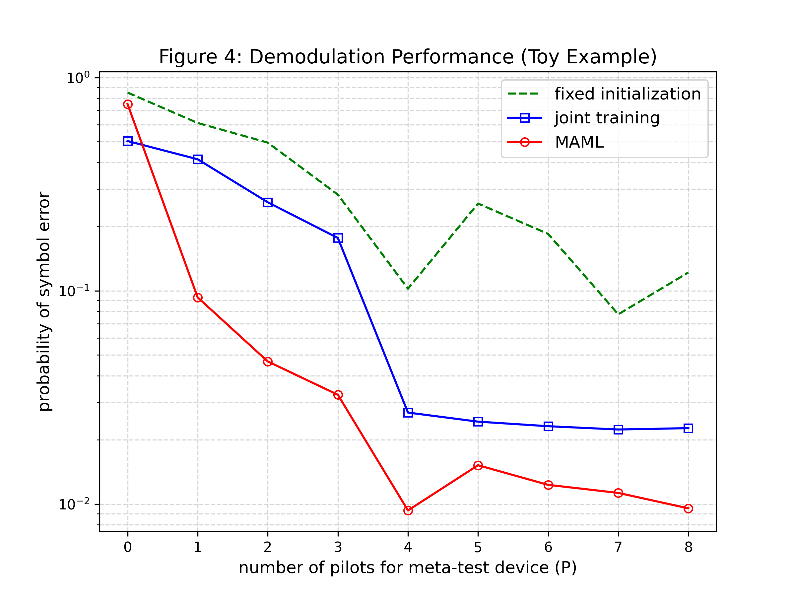
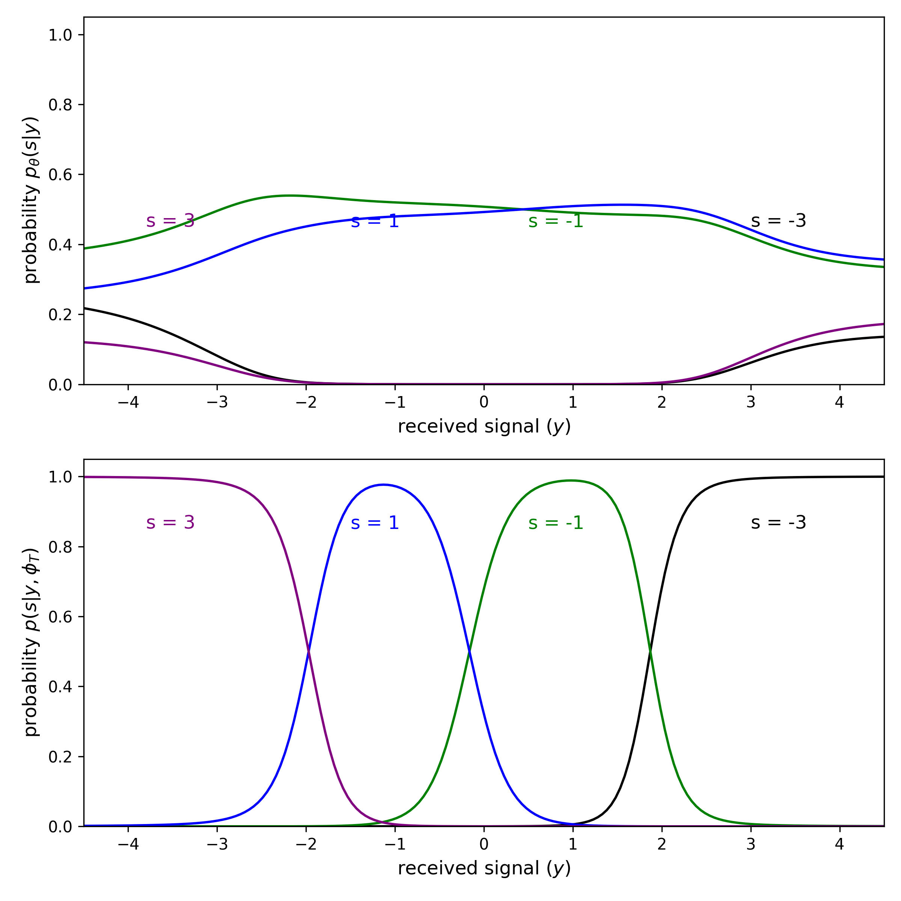
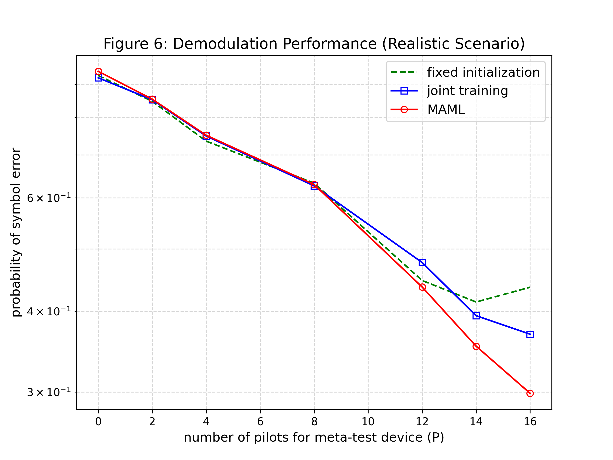
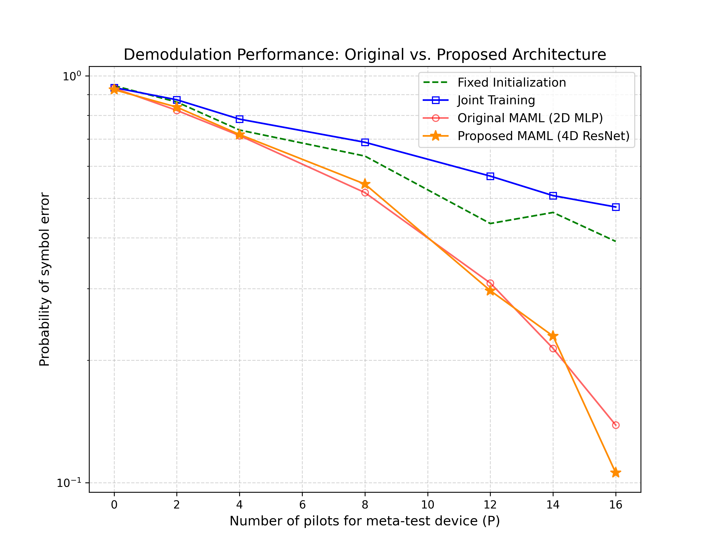
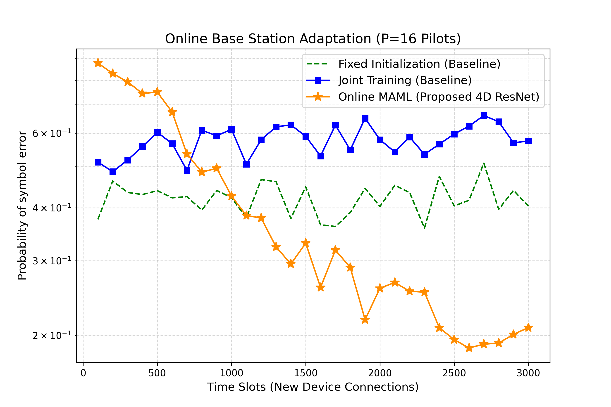

# Learning to Demodulate from Few Pilots via Meta-Learning

This repository contains a PyTorch reproduction and architectural enhancement of the IEEE research papers: **"Learning How to Demodulate from Few Pilots via Meta-Learning"** by Sangwoo Park, Hyeryung Jang, Osvaldo Simeone, and Joonhyuk Kang. 

## 📌 Project Overview

In Internet-of-Things (IoT) networks, devices sporadically transmit short packets of data to save battery. Because these packets are so short, they contain very few "pilot" symbols (known training data). Standard deep learning demodulators fail in this environment because they require thousands of pilots to learn how to untangle the physical channel fading and the cheap hardware's amplifier distortion. 

This project solves that problem by implementing **Model-Agnostic Meta-Learning (MAML)**. By using historical transmissions from *other* IoT devices as a meta-training dataset, the neural network learns a highly sensitive initialization state. When a new device connects, the network can adapt to its unique fading and distortion using as few as 1 to 16 pilots.

Furthermore, this repository proposes **two major novelties** to improve upon the baseline papers' performance:
1. **A Physics-Informed 4D ResNet** that reduces the error rate.
2. **A Continuous Online Streaming** simulation that updates the global meta-brain in real-time without catastrophic forgetting.

---

## 🗂️ Repository Structure

* `maml_toy_example.py`: Baseline reproduction simulating a foundational environment using 4-PAM modulation, binary fading, and a 3-layer neural network.
* `maml_realistic_scenario.py`: Baseline reproduction simulating a complex physical environment using 16-QAM, Rayleigh fading, non-linear amplifier distortion, and a 2D MLP network.
* `maml_novelty_architecture.py`: **[Proposed]** Compares the baseline 2D MLP against a newly engineered Physics-Informed 4D ResNet.
* `maml_novelty_online.py`: **[Proposed]** Simulates continuous online learning, proving the 4D ResNet can dynamically adapt to a streaming timeline of 3,000 IoT devices.
* `figures/`: Contains all evaluation graphs generated by the scripts.
* `papers/`: Contains the reference research papers.

---

## 🚀 Installation & Usage

**Prerequisites:** Python 3.8+, PyTorch, NumPy, and Matplotlib.

1. **Clone the repository:**
   ```bash
   git clone https://github.com/ParthKhiriya/demodulator-meta-learning.git
   cd demodulator-meta-learning
   ```

2. **Install dependencies:**
   ```bash
   pip install torch numpy matplotlib
   ```

3. **Run the baseline reproductions:**
   ```bash
   python maml_toy_example.py
   python maml_realistic_scenario.py
   ```

4. **Run the proposed novelties:**
   ```bash
   python maml_novelty_architecture.py
   python maml_novelty_online.py
   ```

---

## 📊 Baseline Reproductions

### The Toy Example (4-PAM & Binary Fading)
MAML vastly outperforms both Joint Training and Fixed Initialization, achieving sub-1% error rates with only 4 to 6 pilots.



Furthermore, the probability distributions reveal MAML's mechanics. The network parks its decision boundaries perfectly in the center. Upon receiving a few pilots from a new device, it instantly snaps its probabilities to match the specific channel rotation.



### The Realistic Scenario (16-QAM, Rayleigh Fading, & Distortion)
Even when introduced to a highly non-linear amplifier distortion and complex Rayleigh fading, the MAML-initialized network successfully untangles the signal using just 16 pilots, whereas baseline methods fail to converge.



---

## 🌟 Proposed Novelties & Key Results

### Novelty 1: Physics-Informed 4D ResNet
The original MAML baseline feeds raw 2D Cartesian coordinates (Real, Imaginary) into a standard Multi-Layer Perceptron (MLP), forcing the network to waste capacity "re-discovering" trigonometry to unwarp amplifier distortion. 

**The Solution:** We engineered a lightweight **4D Residual Network**. By augmenting the input data with normalized physical properties `[Real, Imaginary, Magnitude, Phase]` and adding a residual "gradient highway" (skip connection), the network's learning efficiency skyrocketed.

**The Result:** When given the exact same computational budget as the baseline (100 adaptation steps), the proposed 4D ResNet dropped the Symbol Error Rate (SER) at P=16 from the baseline's 13.8% down to a highly accurate **10.5%**.



### Novelty 2: Continuous Online Meta-Learning (High-Speed Adaptation)
Instead of training on a fixed, offline dataset, a real-world cell tower experiences a continuous stream of connecting devices. We simulated a live timeline of 3,000 sequential devices, utilizing a historical Replay Buffer to update the global meta-brain in the background.

**The Result:**
In a real-time streaming environment, computational speed is critical. Traditional baselines (Joint Training and Fixed Initialization) were given 500 gradient steps to adapt, yet completely failed, stagnating at 40% to 60% error rates. The proposed Online MAML (4D ResNet) was severely restricted to only **3 adaptation steps**, yet successfully plummeted to a stable **~20%** error rate. This proves the proposed architecture can dynamically adapt to new IoT devices **over 160x faster** than traditional methods without sacrificing reliability.



---

## 📖 References
1. Park, S., Jang, H., Simeone, O., & Kang, J. (2019). *Learning How to Demodulate from Few Pilots via Meta-Learning*. IEEE Signal Processing Advances in Wireless Communications (SPAWC).
2. Park, S., Jang, H., Simeone, O., & Kang, J. (2020). *Learning to Demodulate from Few Pilots via Offline and Online Meta-Learning*. IEEE Transactions on Signal Processing.
